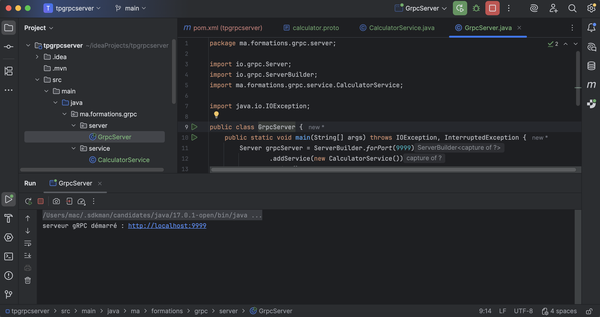
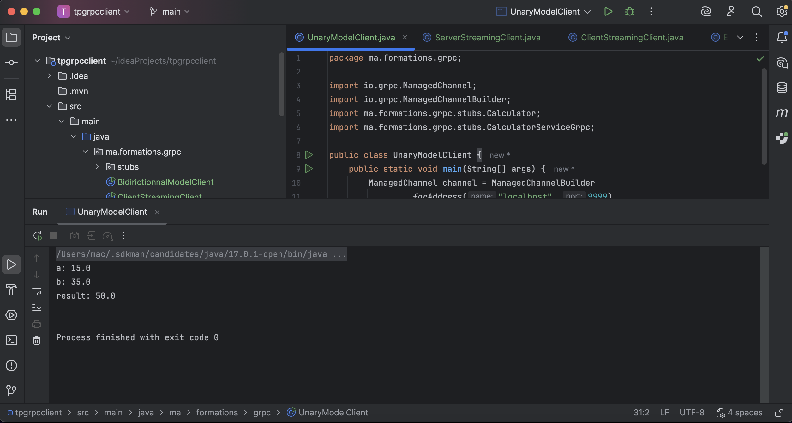
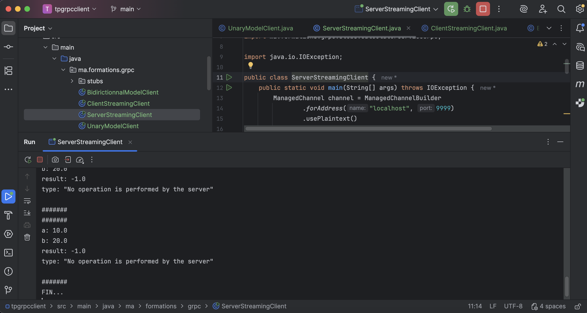
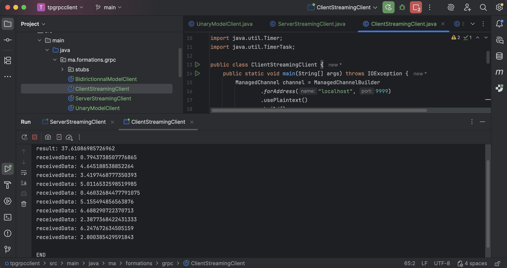
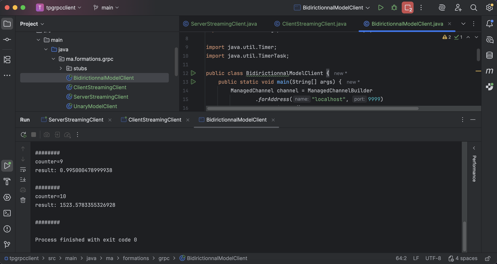

# TP 5 — gRPC avec Java (Unary, Streaming & Bidirectionnel)


Projet du **TP 5 – Introduction à gRPC avec Java**.  
Ce TP a pour objectif de **mettre en œuvre la communication RPC moderne** à l’aide de **gRPC**, **Protocol Buffers** et **Java**, en couvrant **les 4 modèles de communication gRPC**.

---

## 📌 Sommaire

1. [Objectifs du TP](#-objectifs-du-tp)
2. [Concepts clés](#-concepts-clés)
3. [Stack technique](#-stack-technique)
4. [Architecture du projet](#-architecture-du-projet)
5. [Services gRPC implémentés](#-services-grpc-implémentés)
6. [Description des modèles gRPC](#-description-des-modèles-grpc)
7. [Démarrage rapide](#-démarrage-rapide)
8. [Tests & démonstrations](#-tests--démonstrations)
9. [Auteurs](#-auteurs)
10. [Licence](#-licence)

---

## 🎯 Objectifs du TP

- Comprendre le principe de **gRPC (Remote Procedure Call)**
- Utiliser **Protocol Buffers (.proto)** pour définir les services
- Générer automatiquement les **stubs Java**
- Implémenter un **serveur gRPC**
- Implémenter des **clients gRPC Java**
- Maîtriser les **4 modèles de communication gRPC** :
    - Unary
    - Server Streaming
    - Client Streaming
    - Bidirectional Streaming

---

## 🧠 Concepts clés

### 🔹 gRPC
- Framework RPC moderne basé sur **HTTP/2**
- Performant, typé, bidirectionnel
- Communication binaire via **Protocol Buffers**

### 🔹 Protocol Buffers (Protobuf)
- Langage IDL pour définir services & messages
- Génération automatique de code client / serveur
- Sérialisation rapide et compacte

### 🔹 Streaming gRPC
- Communication **asynchrone**
- Flux continus de données
- Adapté aux systèmes temps réel et distribués

---

## 🛠️ Stack technique

| Technologie | Version |
|------------|---------|
| Java | 17 |
| gRPC Java | 1.58 |
| Protocol Buffers | 3.x |
| Maven | ✅ |
| IntelliJ IDEA | Ultimate |
| OS | macOS |
| Architecture | Client / Serveur |

---

## 🏗️ Architecture du projet
```
tp5-grpc/
├── tpgrpcserver/
│ ├── pom.xml
│ ├── src/main/java/ma/formations/grpc/
│ │ ├── server/
│ │ │ └── GrpcServer.java
│ │ └── service/
│ │ └── CalculatorService.java
│ └── src/main/resources/
│ └── calculator.proto
│
├── tpgrpcclient/
│ ├── pom.xml
│ ├── src/main/java/ma/formations/grpc/
│ │ ├── UnaryModelClient.java
│ │ ├── ServerStreamingClient.java
│ │ ├── ClientStreamingClient.java
│ │ └── BidirictionnalModelClient.java
│ └── src/main/resources/
│ └── calculator.proto
│
└── README.md
```


---

## 🧩 Services gRPC implémentés <br/>

### Service défini dans `calculator.proto` : <br/>

```
service CalculatorService {
  rpc sum(UnaryRequest) returns (UnaryResponse);
  rpc getOperationStream(ServerStreamRequest) returns (stream ServerStreamResponse);
  rpc performStream(stream ClientStreamRequest) returns (ClientStreamResponse);
  rpc fullStream(stream BidirectionalStreamRequest) returns (stream BidirectionalStreamResponse);
}
```
---


## 🔄 Description des modèles gRPC <br/>

| Modèle                  | Type  | Description                |
| ----------------------- | ----- | -------------------------- |
| Unary                   | 1 → 1 | Une requête, une réponse   |
| Server Streaming        | 1 → N | Le serveur renvoie un flux |
| Client Streaming        | N → 1 | Le client envoie un flux   |
| Bidirectional Streaming | N ↔ N | Flux bidirectionnel        |

---

## 🚀 Démarrage rapide

### 1️⃣ Prérequis <br/>

✅ Java 17  <br/>
✅ Maven <br/>
✅ IntelliJ IDEA <br/>
✅ Git <br/>

### 2️⃣ Cloner le projet <br/>
```
git clone https://github.com/AnasKrir/TP5-gRPC.git
cd tp5-grpc
```

### 3️⃣ Générer les stubs gRPC <br/>

- Serveur : <br/>
```
cd tpgrpcserver
mvn clean install
```

- Client : <br/>
```
cd ../tpgrpcclient
mvn clean install
```

### 4️⃣ Lancer le serveur gRPC  <br/>

**_Depuis IntelliJ :_** <br/>

```
GrpcServer.java
```

**_Sortie console :_** <br/>
#### serveur gRPC démarré : http://localhost:9999 <br/>


| serveur gRPC démarré |
|----------------------|
|       |

#### ⚠️ Ce lien n’est pas accessible via un navigateur (gRPC ≠ HTTP classique). <br/>

---

## 🔗 Tests & démonstrations <br/>

### 🔹 Test 1 — Unary RPC <br/>

```
UnaryModelClient
```

**_Résultat :_** <br/>
```
a: 15.0
b: 35.0
result: 50.0
```

| Test 1 — Unary RPC |
|--------------------|
|     |


### 🔹 Test 2 — Server Streaming <br/>

```
ServerStreamingClient
```

#### ➡️ Le serveur envoie plusieurs opérations (addition, soustraction, etc.) de manière continue. <br/>

| Test 2 — Server Streaming |
|---------------------------|
|            |


### 🔹 Test 3 — Client Streaming <br/>

```
ClientStreamingClient
```

**_résultat :_** <br/>

#### ➡️ liste des données reçues <br/>

#### ➡️ Le client envoie plusieurs valeurs <br/>
#### ➡️ Le serveur calcule la somme finale et renvoie : <br/>

| Test 3 — Client Streaming |
|---------------------------|
|            |


### 🔹 Test 4 — Bidirectional Streaming <br/>

```
BidirictionnalModelClient
```


#### ➡️ Le client envoie des valeurs <br/>
#### ➡️ Le serveur répond instantanément avec le carré de chaque valeur <br/>

| Test 4 — Bidirectional Streaming |
|----------------------------------|
|                   |


---


## 👥 Auteurs

Mallouk Mohammed Taha <br/>
Étudiants Ingénieurs — MIAGE <br/>
TP réalisé dans le cadre du module ARCHITECTURE DES COMPOSANTS D'ENTREPRISES <br/>

**_Technologies :_** <br/>
Java · gRPC · Protocol Buffers · Maven · Client-Server · Streaming RPC <br/>

---


## 📄 Licence

✅ Projet sous licence MIT  <br/>
Libre d’utilisation, modification et distribution à des fins pédagogiques.  <br/>

© 2025 — Mallouk Mohammed Taha  <br/>

---
